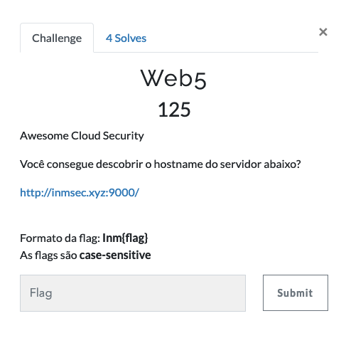
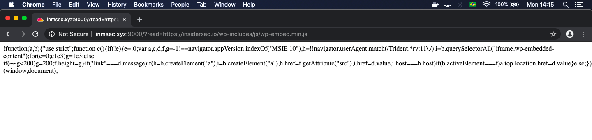
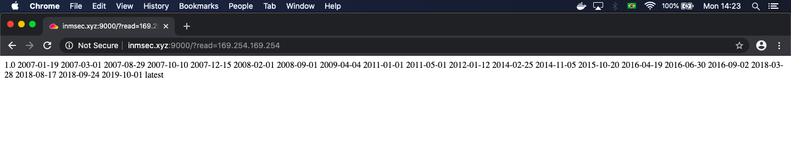

# Web5

## Writeup

O desafio desde o início já apresentava algumas dicas que poderiam ajudar o Player a resolve-lo:

Abrindo o desáfio, nos deparamos com o seguinte comportamento

A página em questão, possuia um parâmetro chamado de **?read=** que recebia uma página remota e a incluia dentro do da página anterior.

RAW URL: http://inmsec.xyz:9000/?read=https://insidersec.io/wp-includes/js/wp-embed.min.js

Esse tipo de comportamento nos leva a pensar em várias vulnerabilidades, como por exemplo XSS, Remote File Include e Server Side Request Forgery...

E de fato, a aplicação estava vulnerável a essas vulnerabilidades e talvez até a mais algumas outras... Mas lembrando o objetivo do desafio, precisavamos descobrir o hostname do servidor e no inicio do desafio existe uma pequena dica, o nome do mesmo: "Awesome Cloud Security" ou AWS.

Pra quem conhece um pouco sobre AWS, sabe que a mesma possuí uma instância fixa em todos seus serviços que é responsável por armazenar alguns metadados referentes aos serviços, e no caso essa instância só é acessível através do serviço original e uma das informações que ela armazena é justamente o hostname do servidor.

Essa instância é acessível através do IP: 169.154.169.254, sendo assim só era necessário tentar fazer uma requisição para essa página utilizando a aplicação vulneravel: http://inmsec.xyz:9000/?read=169.254.169.254

E o resultado foi:

Dessa forma, só precisavamos encontrar o arquivo responsável por armazenar o hostname da instância e iriamos descobrir a nossa flag.
Que no fim seria: http://inmsec.xyz:9000/?read=169.254.169.254/latest/meta-data/hostname

---

[Voltar ao Menu Web](https://writeup.insidersec.io/web)
